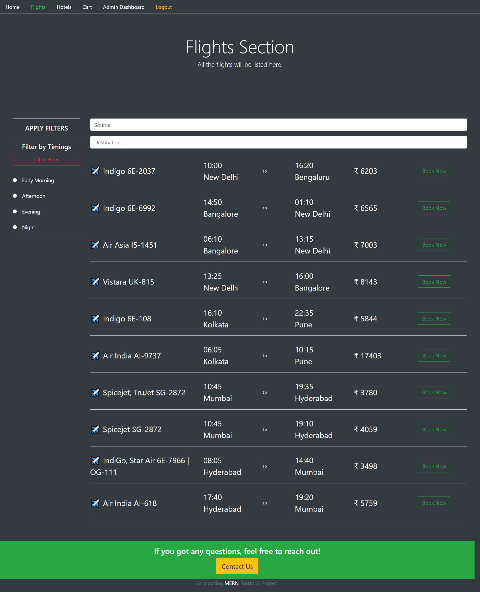
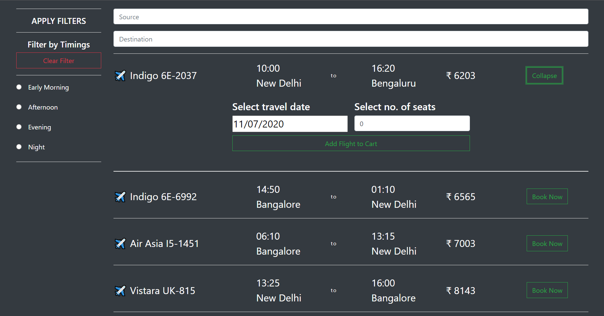
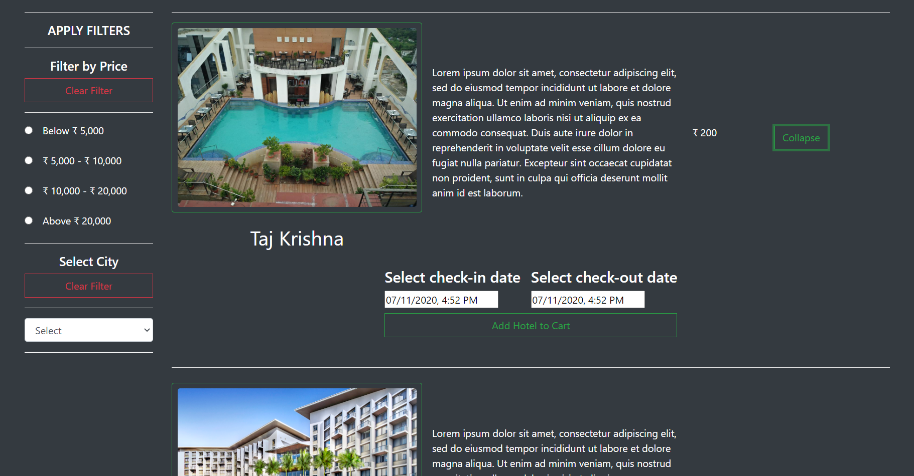
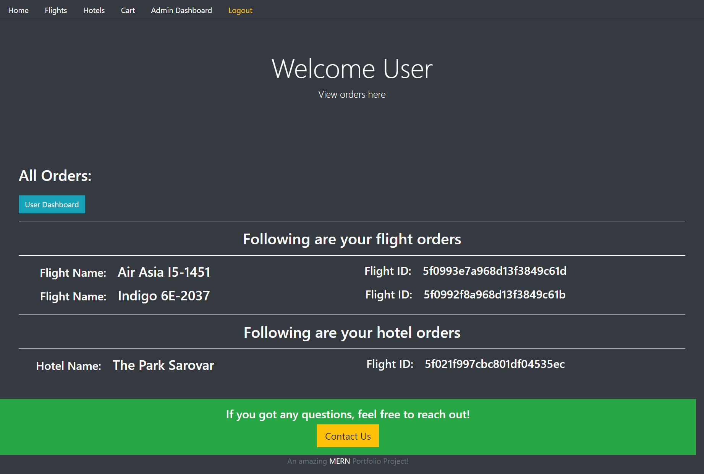
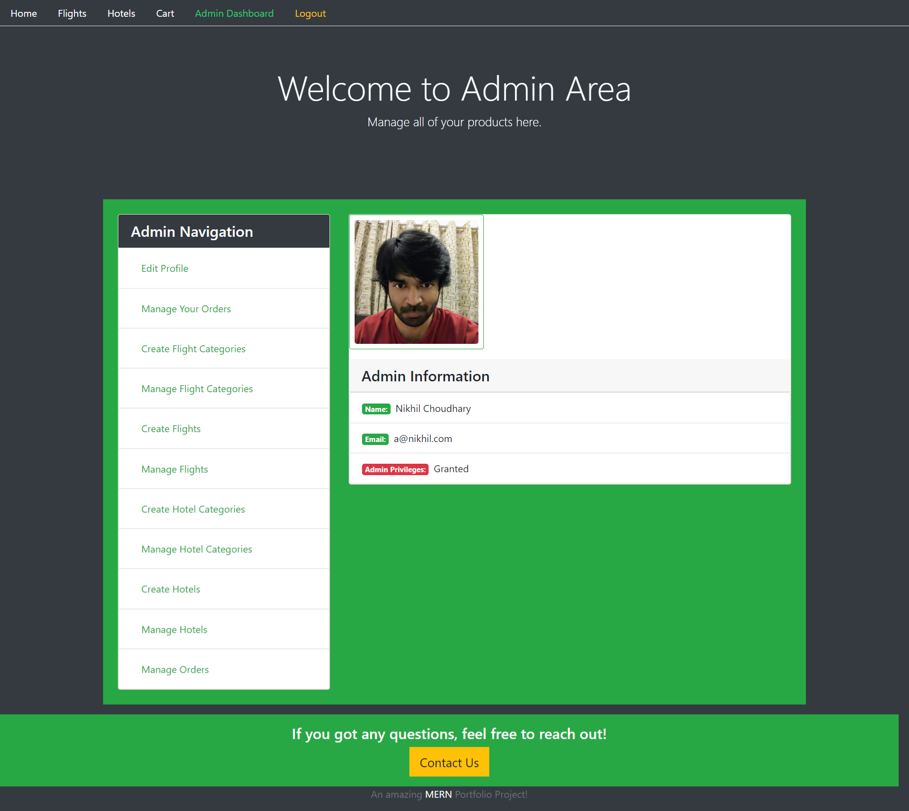

# Tripster-Frontend
#### This is a MERN Stack Web Application. A user can create an account, signin, book flights and hotels, and make payment using BrainTree's payment gateway. The app has an admin section where an admin can manage the flights and hotels using CRUD (Create, Read, Update, and Delete) operations. The user can view their purchase history along with the transaction and the order ID.
## Requirements
### You need to have the following things installed in your system before you can run this:-
#### 1. NodeJS
#### 2. NPM
#### 3. MongoDB
### You will need to run the backend for this project at https://github.com/nikpydev/Tripster-Backend
## Usage
### Run the following commands to get this project up and running.
#### npm install (this will install all the dependencies of the project and create your node-modules folder)
#### npm start (this will run the 'start' script inside your package.json file)

